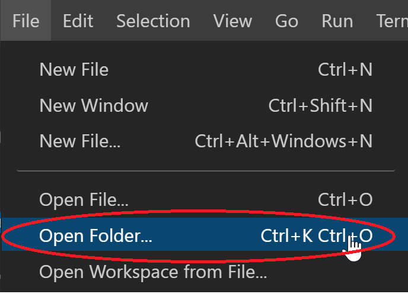
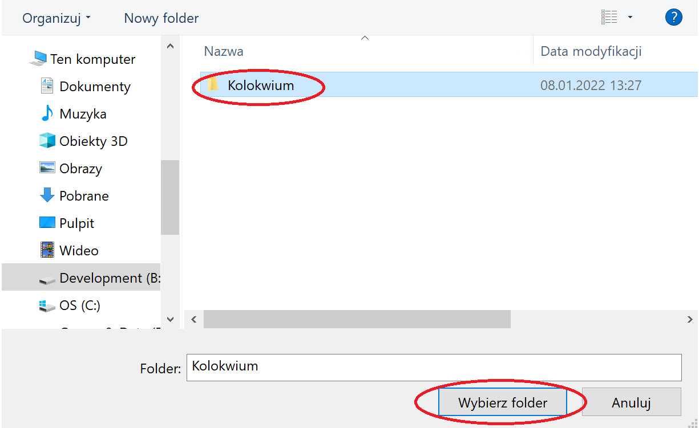

# Kolokwium
## Przygotowanie do kolokwium
### Pobranie i przetestowanie szablonu kolokwium
1) Proszę pobrać gałąź kolokwium w formie pliku zip. A następnie wypakować jego zawartość.
  </img>
2) Proszę otworzyć folder `Kolokwium` przy pomocy Visual Studio Code.

    </img>

    </img>

    </img>

3) Proszę otworzyć plik `Kolokwium.Web -> appsettings.json` a następnie podmienić wartość `Database` connection stringa podając swoje imię i nazwisko (bez znaków diakrytycznych) zamiast `Imie_Nazwisko`. Dzięki temu w momencie zastosowania pierwszej migracji utworzy się nowa baza danych zaczynającą się Państwa imieniem i nazwiskiem.
    ```json
    {
      "ConnectionStrings": {
        "DefaultConnection": "Server=(localdb)\\mssqllocaldb;Database=Imie_NazwiskoAppDb;Trusted_Connection=True;MultipleActiveResultSets=true"
      },
      "Logging": {
        "LogLevel": {
          "Default": "Information",
          "Microsoft": "Warning",
          "Microsoft.Hosting.Lifetime": "Information"
        }
      },
      "AllowedHosts": "*"
    }
    ```
4) Proszę postąpić analogicznie dla projektu `Kolokwium.API -> appsettings.json`.
5) Proszę w Visual Studio Code otworzyć nowy terminal `Terminal -> New Terminal`.
    
6) Nastepnie proszę pobrać wszystkie potrzebne biblioteki oraz skompilować całą solucję. W tym celu proszę wykonać poniższe polecenie.

    ```
    dotnet build
    ```
7) Proszę upewnić się że narzędzia `dotnet-ef tool update` oraz `dotnet-aspnet-codegenerator` są poprawnie zainstalowane, w tym celu proszę wykonać poniższe polecenia.    
    ```
    dotnet tool update --global dotnet-ef --version 8.0.2
    dotnet tool update -g dotnet-aspnet-codegenerator --version 8.0.2
    ```
    
8) W celu weryfikacji poprawności działania aplikacji proszę ją uruchomić.

    ```
    dotnet run --project Kolokwium.Web
    ```

    Aplikacja powinna być dostępna pod adresem: [http://localhost:5000](http://localhost:5000).
    
    
8) Analogicznie należy uruchomić aplikację Web API.
  
    ```
    dotnet run --project Kolokwium.API
    ```
   Web API powinno być dostępne pod adresem: `http://localhost:5050/api/{controller}` 

   Aplikacja Swagger jest dostępna pod adresem: [http://localhost:5050](http://localhost:5050).
   
    
9) Jeśli obie aplikacje działają poprawnie proszę je zamknąć przy pomocy kombinacji klawiszy `ctrl + c`.

### Proszę przejść do wykonywania zadań

```diff
- Życzę Państwu powodzenia na kolokwium! :)
```

### Umieszenie rozwiązania w archiwum
1)  Po zakończeniu kolokwium usunąc foldery `bin` i `obj` ze wszystkich projektów.
    
    </img>
 
2)  Następnie proszę spakować całą solucję do pliku `*.zip` (nazwa dowolna). 
 
    </img>
    
3)  Proszę przejść pod adres [Archiver](https://ik2a.kik.pcz.pl/archiver/TestArchive/Index)
4)  Następnie proszę wybrać Państwa test i kilknąć przycisk `Link`.

    
    
5)  Proszę wypełnić formularz podając swoje dane, wskazać plik `Rozwiazanie_Kolokwium.zip`, a następnie nacisnąc przycisk `Upload`

    